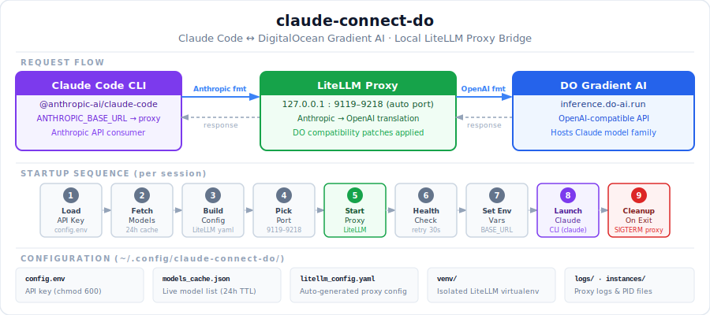
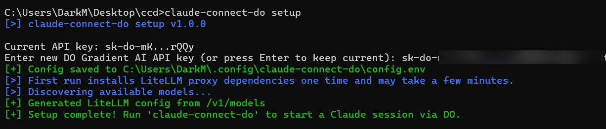
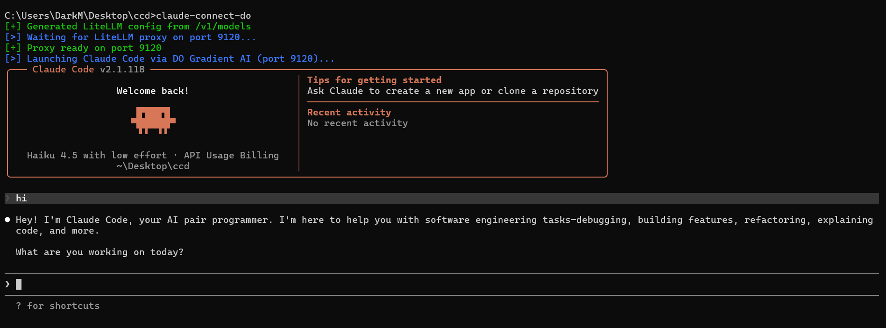
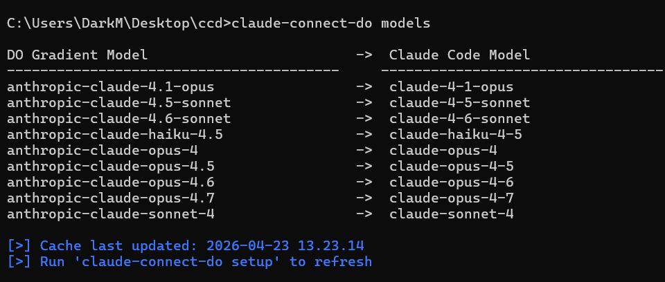
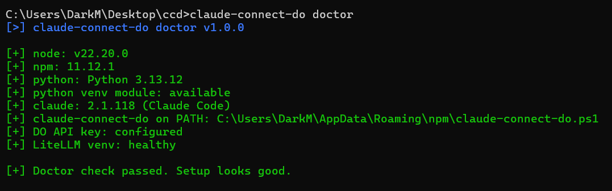

<div align="center">

# claude-connect-do

**Run [Claude Code](https://github.com/anthropics/claude-code) against [DigitalOcean Gradient AI](https://www.digitalocean.com/products/gradient/platform)**

[](https://www.npmjs.com/package/claude-connect-do)
[](https://opensource.org/licenses/MIT)
[](https://nodejs.org)
[](#prerequisites)

**[📦 Install from npm](https://www.npmjs.com/package/claude-connect-do)** | **[📖 GitHub Repository](https://github.com/darkness0308/claude-connect-do)** | **[⚡ Quick Start](#quick-start)**

Bridges [Claude Code](https://github.com/anthropics/claude-code)'s Anthropic API format to [DigitalOcean Gradient AI](https://www.digitalocean.com/products/gradient/platform)'s OpenAI-compatible endpoint via an automatically managed local [LiteLLM](https://github.com/BerriAI/litellm) proxy — zero manual configuration required.

Current stable release: **v1.0.2**

</div>

---

## Architecture



> **How it works:** `claude-connect-do` starts a local LiteLLM proxy that translates Claude Code's Anthropic-format requests into DigitalOcean's OpenAI-compatible format. Claude Code never knows it's talking to a different backend — it just works.

---

## Table of Contents

- [Why Use This](#why-use-this)
- [Prerequisites](#prerequisites)
- [Quick Start](#quick-start)
- [Installation Options](#installation-options)
- [First-Time Setup](#first-time-setup)
- [Commands](#commands)
- [Typical Usage](#typical-usage)
- [Configuration](#configuration)
- [Shell Setup Notes](#shell-setup-notes)
- [Troubleshooting](#troubleshooting)
- [How It Works (Deep Dive)](#how-it-works-deep-dive)
- [Images in This Repository](#images-in-this-repository)
- [Acknowledgments](#acknowledgments)
- [License](#license)

---

## Why Use This

| Feature | Detail |
|---|---|
| **Zero manual setup** | No manual LiteLLM install, no global Python package wrangling |
| **Cross-platform** | Works on macOS, Linux, and Windows |
| **Multi-session** | Run multiple independent `claude-connect-do` sessions concurrently |
| **Auto port selection** | Picks a free port in `9119–9218` — no conflicts, no config |
| **Safe PATH wiring** | `claude-connect-do install` is idempotent and non-destructive |
| **Actionable diagnostics** | `claude-connect-do doctor` prints exactly what to fix |

---

## Prerequisites

| Requirement | Install |
|---|---|
| Node.js 18+ | [nodejs.org](https://nodejs.org) or `brew install node` |
| Python 3 + `venv` | `brew install python` / `apt install python3 python3-venv` |
| Claude Code CLI | `npm install -g @anthropic-ai/claude-code` |
| DO Gradient AI API key | [DigitalOcean Control Panel → GenAI](https://cloud.digitalocean.com/gen-ai) |

> LiteLLM is automatically installed into `~/.config/claude-connect-do/venv` on first `setup`. This one-time install may take a few minutes.

### Windows

```powershell
winget install OpenJS.NodeJS.LTS
winget install Python.Python.3.12
npm install -g @anthropic-ai/claude-code
```

### Linux / Kali — npm install without sudo

If `npm install -g` fails with `EACCES`:

```bash
npm config set prefix "$HOME/.local"
export PATH="$HOME/.local/bin:$PATH"
npm install -g claude-connect-do
```

Or as a fallback:

```bash
sudo npm install -g claude-connect-do
```

---

## Quick Start

**Recommended — install globally via npm:**

```bash
npm install -g claude-connect-do
claude-connect-do setup       # paste your DO Gradient AI API key
claude-connect-do             # start a Claude session
```



> **Important:** When you run `claude-connect-do`, it automatically starts a local LiteLLM proxy on an available port (e.g., `9119–9218`). This proxy creates the bridge between Claude Code and DigitalOcean Gradient AI. **Keep the session running** — do not close the terminal until you're done using Claude. Closing the terminal will terminate the proxy connection.

**Run directly from the repo (no install):**

```bash
cd /path/to/claude-connect
bash bin/claude-connect-do doctor    # validate dependencies
bash bin/claude-connect-do setup     # store API key + install LiteLLM
bash bin/claude-connect-do           # start a session
```

**Build and test as a tarball:**

```bash
cd /path/to/claude-connect
npm pack                              # creates claude-connect-do-<version>.tgz
npm install -g ./claude-connect-do-<version>.tgz
claude-connect-do version
```

---

## Installation Options

### Option A: Portable folder

If you have the folder on your machine:

macOS/Linux:

```bash
cd /path/to/claude-connect
chmod +x bin/claude-connect-do
./bin/claude-connect-do install
claude-connect-do doctor
claude-connect-do setup
claude-connect-do
```

Windows PowerShell:

```powershell
cd C:\path\to\claude-connect
Set-ExecutionPolicy -Scope Process Bypass
.\bin\claude-connect-do.ps1 install
claude-connect-do doctor
claude-connect-do setup
claude-connect-do
```

### Option B: npm package

```bash
npm install -g claude-connect-do
claude-connect-do doctor
claude-connect-do setup
claude-connect-do
```

Windows PowerShell:

```powershell
npm install -g claude-connect-do
claude-connect-do doctor
claude-connect-do setup
claude-connect-do
```

---

## First-Time Setup

```bash
claude-connect-do install   # one-time PATH setup for bash/zsh/profile
claude-connect-do doctor    # validate node / python / claude / venv / config
claude-connect-do setup     # save API key, install LiteLLM venv, discover models
claude-connect-do           # start a Claude Code session via DO
```

Windows PowerShell:

```powershell
claude-connect-do install   # one-time PATH setup for current Windows user
claude-connect-do doctor
claude-connect-do setup
claude-connect-do
```

---

## Commands

| Command | Description |
|---|---|
| `claude-connect-do` | Start an interactive Claude session via DO Gradient AI |
| `claude-connect-do <args>` | Pass arguments through to `claude` (e.g. `-p "hello"`) |
| `claude-connect-do install` | Install to `~/.local/bin` and configure shell PATH |
| `claude-connect-do setup` | Configure API key, install LiteLLM venv, discover models |
| `claude-connect-do doctor` | Validate all dependencies and configuration |
| `claude-connect-do models` | Show discovered DO → Claude Code model name mappings |
| `claude-connect-do status` | List running proxy sessions with port and uptime |
| `claude-connect-do stop-all` | Gracefully terminate all running proxy instances |
| `claude-connect-do version` | Print version string |
| `claude-connect-do help` | Print command summary |

---

## Typical Usage

```bash
# Start an interactive session
claude-connect-do

# One-shot prompt
claude-connect-do -p "explain this codebase"

# Specify a model explicitly
claude-connect-do --model claude-sonnet-4-6 -p "hello"

# Inspect model mappings and running sessions
claude-connect-do models
claude-connect-do status
```





---

## Configuration

All configuration lives under `~/.config/claude-connect-do/`.

| File | Purpose |
|---|---|
| `config.env` | DO Gradient AI API key — `chmod 600`, never logged |
| `models_cache.json` | Cached live model list from DO (24-hour TTL) |
| `litellm_config.yaml` | Auto-generated LiteLLM proxy config with model aliases |
| `litellm_wrapper.py` | DO compatibility monkey-patches (auto-written) |
| `venv/` | Isolated Python virtualenv for LiteLLM |
| `instances/proxy-{port}.pid` | One PID file per running session |
| `logs/proxy-{port}.log` | Per-session proxy stdout/stderr |

---

## Shell Setup Notes

`claude-connect-do install` on macOS/Linux:

- Creates `~/.local/bin/claude-connect-do` symlink.
- Appends `export PATH="$HOME/.local/bin:$PATH"` to `~/.bashrc`, `~/.zshrc`, and `~/.profile`.
- Is **idempotent** — safe to run multiple times.

`claude-connect-do install` on Windows:

- Creates `%USERPROFILE%\bin\claude-connect-do.cmd` launcher.
- Adds `%USERPROFILE%\bin` to the current user's PATH registry key.
- Is **idempotent** — safe to run multiple times.

To apply PATH changes in your current terminal on macOS/Linux:

```bash
source ~/.bashrc   # or ~/.zshrc or ~/.profile
```

To apply PATH changes in your current PowerShell session:

```powershell
$env:Path = "$HOME\bin;" + $env:Path
```

---

## Troubleshooting

Run the built-in diagnostics first — it prints an actionable fix for every issue found:

```bash
claude-connect-do doctor
```



| Symptom | Fix |
|---|---|
| `claude: command not found` | `npm install -g @anthropic-ai/claude-code` |
| `npm install -g` fails with `EACCES` | `npm config set prefix "$HOME/.local"` then retry |
| LiteLLM venv broken | `rm -rf ~/.config/claude-connect-do/venv && claude-connect-do setup` |
| LiteLLM venv broken (Windows) | `Remove-Item -Recurse -Force $HOME\.config\claude-connect-do\venv; claude-connect-do setup` |
| Proxy startup failure | Check `~/.config/claude-connect-do/logs/proxy-<port>.log` |
| Model mapping stale | `claude-connect-do setup` (re-fetches live model list) |

---

## How It Works (Deep Dive)

Each `claude-connect-do` invocation runs the following steps:

1. **Load API key** from `~/.config/claude-connect-do/config.env`
2. **Fetch models** — `GET inference.do-ai.run/v1/models` (result cached 24 h)
3. **Build LiteLLM config** — generates every plausible model name alias so any name Claude Code sends is routed correctly
4. **Pick port** — scans `9119–9218`, claims the first free TCP port (fully automatic, no prompt)
5. **Apply patches** — `litellm_wrapper.py` fixes three DO-specific incompatibilities before the proxy starts
6. **Start proxy** — launches LiteLLM on `127.0.0.1:{port}` with the generated config
7. **Health check** — polls `/health/readiness` with up to 30 s of retries
8. **Set env** — exports `ANTHROPIC_BASE_URL=http://127.0.0.1:{port}` and a fresh `ANTHROPIC_AUTH_TOKEN`
9. **Launch Claude** — runs `claude [your-args]` normally; proxy is killed via `SIGTERM` on exit

Multiple `claude-connect-do` sessions can run concurrently — each gets its own port, proxy process, and PID file.

### DO Compatibility Patches

`litellm_wrapper.py` transparently applies three patches before proxy startup:

| Patch | Reason |
|---|---|
| `uvloop` removal | `uvloop` crashes on Python 3.14+; forced to `asyncio` event loop |
| `context_management` stripping | Claude Code sends this param; DO rejects it |
| Responses API bypass | DO doesn't implement OpenAI Responses API; thinking params are rerouted |

---

## Acknowledgments

This project was inspired by [**claudo**](https://github.com/digitalocean/claudo) — the original DigitalOcean bridge. `claude-connect-do` builds on the same core concept (bridging Claude Code to DO Gradient AI) with enhanced features, improved stability, and a streamlined installation experience.

---

## License

MIT — see [LICENSE](LICENSE) for details.


